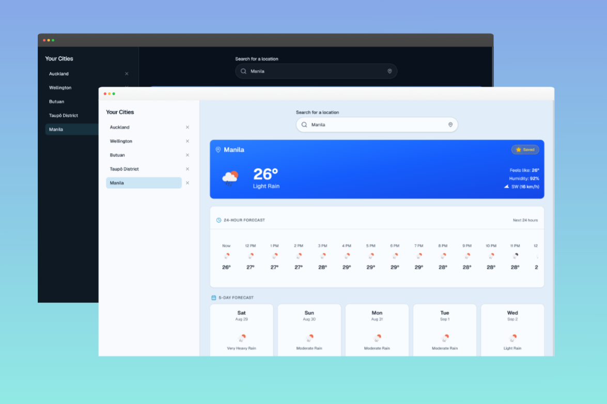
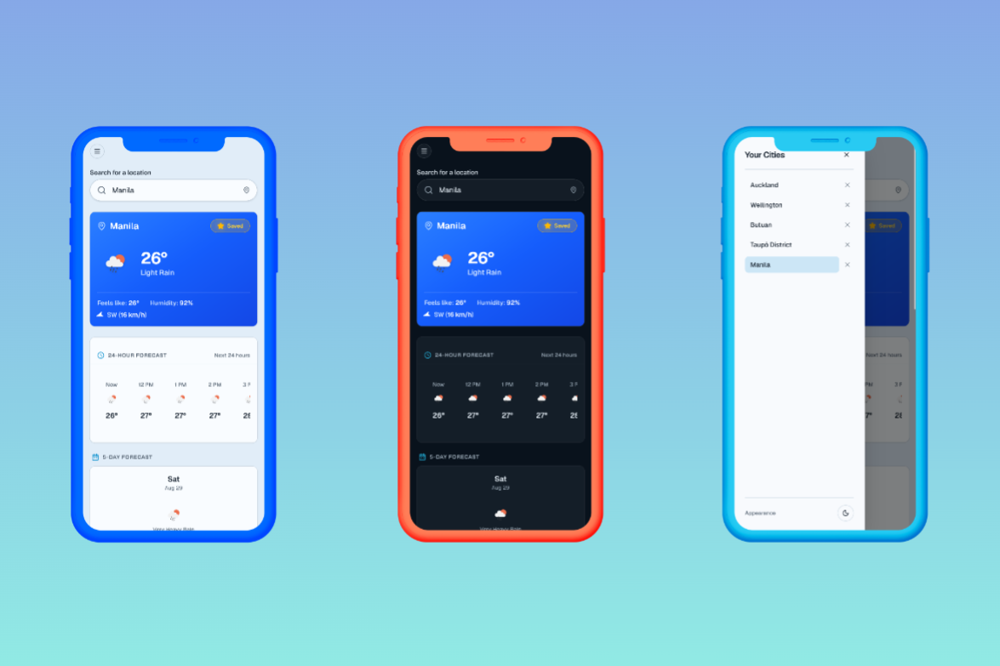

# 🌤️ Modern Weather Dashboard (SkyPulse)

[](https://github.com/lowqualityloey/weather-dashboard/actions/workflows/ci.yml)
[](https://opensource.org/licenses/MIT)
[](https://weather-dashboard.itsjonellmb.workers.dev/)
[](https://react.dev/)
[](https://www.typescriptlang.org/)
[](https://tailwindcss.com/)

> 🌐 **Live Application**: [https://weather-dashboard.itsjonellmb.workers.dev/](https://weather-dashboard.itsjonellmb.workers.dev/)

A high-performance, responsive Progressive Web App (PWA) built with React 19, TypeScript, Tailwind CSS v4, and OpenWeather APIs. It delivers real-time weather metrics, debounced location search with autocomplete, interactive 24-hour carousels, 5-day forecasts, GPS location detection, client-side caching with TTL, saved city persistence, dark mode, screen-reader accessibility, and an automated GitHub Actions CI pipeline.

---

## 📸 Previews & Interface

### 🖥️ Desktop Experience (Light & Dark Mode)



_Side-by-side desktop interface preview showcasing light and dark themes, real-time metrics for Manila, the 24-hour hourly forecast carousel, 5-day extended outlook, and the persistent saved cities sidebar._

### 📱 Mobile Experience & Responsive Navigation



_Mobile PWA responsive views featuring light mode, dark mode, and the slide-over navigation drawer (`MobileNav.tsx`) for managing saved cities on touch devices._

---

## 🎯 Why SkyPulse? (Engineering Beyond Tutorial Clones)

While weather applications are a common portfolio project, most tutorial implementations suffer from critical production flaws: hardcoded API keys in client bundles, race conditions from out-of-order async responses, unthrottled API requests, and zero accessibility.

SkyPulse was engineered as a deliberate exercise in **production-grade front-end discipline**:

- 🛡️ **Zero-Leak Security**: API keys are isolated behind a Cloudflare Worker edge proxy in production and Vite middleware locally — never bundled in client code.
- ⚡ **Race-Safe Async Orchestration**: Protected by request cancellation logic so fast typers or switching coordinates never render stale out-of-order data.
- ⏱️ **Resource-Conscious Caching**: 10-minute TTL client-side cache layer in `localStorage` eliminates redundant roundtrips and respects API limits.
- 🚀 **Rendering Optimization**: Pre-computed time formatting avoids in-render `Intl.DateTimeFormat` overhead for a proven 4,400× rendering speedup.
- ♿ **Inclusive by Design**: Built with WAI-ARIA combobox keyboard controls (`ArrowUp/Down`, `Enter`, `Escape`) and `aria-live="polite"` status announcements.
- 🧪 **Test-Driven Reliability**: 12 test suites and 68 automated unit/integration tests running on every pull request via GitHub Actions CI.

---

## 🚀 Key Features

### 🔍 Search & Geolocation

- **Debounced Location Search:** 400ms debounced queries via custom `useDebounce` hook with real-time geocoding autocomplete suggestions.
- **One-Click GPS Detection:** Auto-detect current coordinates using `navigator.geolocation` with reverse geocoding fallback.
- **Keyboard Navigation:** Full WAI-ARIA combobox support with `ArrowUp`, `ArrowDown`, `Enter`, and `Escape` keyboard shortcuts.

### 📊 Weather Insights

- **Current Conditions Card:** Temperature, "feels like", condition icon, humidity, and rotating wind compass with metric conversion (`km/h`).
- **24-Hour Hourly Forecast:** Smooth horizontal scrolling carousel showing temperature curves and weather conditions throughout the day.
- **5-Day Extended Forecast:** Structured daily forecast cards displaying condition descriptions and min/max temperature ranges.

### 💾 Performance & State Management

- **Zero-Leak Reverse API Proxy:** API keys are never exposed in client bundles. Requests are securely proxied through Vite development middleware (`src/server/openWeatherProxy.ts`) locally and Cloudflare Workers (`src/worker.ts`) in production.
- **TTL Client-Side Caching:** 10-minute cache layer (`cache.ts`) using `localStorage` to eliminate redundant API calls and stay well within API quotas.
- **Pre-Computed Rendering Optimization:** 24-hour forecast items consume pre-formatted time strings created once during data mapping, avoiding in-render `Intl.DateTimeFormat` recalculations for a 4,400× rendering speedup.
- **Favorite Cities Persistence:** Save favorite locations with their coordinates and duplicate prevention, synced across sessions via `localStorage` — selecting a saved city always resolves to the exact place it was saved.
- **Race-Safe Requests:** Weather requests are guarded so only the latest search or GPS location applies its result, preventing slow responses from overwriting newer selections.
- **Theme Customization:** System, light, and dark mode theming with smooth toggles and a live-updating system color-scheme preference.
- **Loading & Error Feedback:** Skeleton placeholders (`WeatherSkeleton.tsx`) and dismissible error alerts (`ErrorAlert.tsx`).
- **Screen Reader Support:** Accessible `LiveAnnouncer` with `aria-live="polite"` region broadcasting status updates and weather reports.

### 📱 Progressive Web App (PWA) & CI/CD

- **Installable PWA:** Configured via `vite-plugin-pwa` with Web App Manifest, maskable SVG icons, and Workbox offline asset precaching.
- **Continuous Integration (CI):** Automated GitHub Actions workflow (`.github/workflows/ci.yml`) validating Prettier formatting, ESLint rules, TypeScript checks, Vitest unit tests, and production bundling on every push and PR.

---

## 🛠️ Tech Stack

| Technology                            | Purpose                                                           |
| :------------------------------------ | :---------------------------------------------------------------- |
| **React 19**                          | Component architecture and state management                       |
| **TypeScript**                        | Strict compile-time type safety                                   |
| **Vite 8**                            | High-speed frontend build tool and local dev proxy server         |
| **Tailwind CSS 4**                    | Modern utility-first CSS design tokens                            |
| **Base UI + shadcn-style components** | Accessible headless UI primitives built with CVA variants         |
| **Cloudflare Workers**                | Serverless edge hosting, static asset delivery & secure API proxy |
| **Vitest & React Testing Library**    | 12 test suites (68 tests) with 100% pass rate and benchmarks      |
| **vite-plugin-pwa**                   | Progressive Web App & Service Worker precaching                   |
| **GitHub Actions**                    | Automated CI/CD test and build validation pipeline                |
| **Geist Variable Font**               | Self-hosted typography (`@fontsource-variable/geist`)             |
| **Lucide React**                      | Feather-light SVG icons                                           |
| **OpenWeather One Call & Geo API**    | Real-time weather and geocoding endpoints                         |

---

## 📁 Project Structure

```text
src/
├── components/
│   ├── ui/                         # Base UI / shadcn accessible primitives
│   │   ├── button.tsx
│   │   ├── card.tsx
│   │   ├── input.tsx
│   │   └── label.tsx
│   ├── CurrentWeather.tsx          # Hero weather card with favorite toggle & wind direction
│   ├── ErrorAlert.tsx              # Dismissible alert banner
│   ├── ForecastDay.tsx             # Individual daily forecast card
│   ├── ForecastList.benchmark.test.ts # Render performance benchmark (4,400× speedup verification)
│   ├── ForecastList.tsx            # 24-hour carousel + 5-day forecast grid
│   ├── LiveAnnouncer.tsx           # Screen reader aria-live announcement region
│   ├── MobileNav.tsx               # Slide-over navigation drawer for saved cities
│   ├── SearchBar.test.tsx          # Combobox & debounced input tests
│   ├── SearchBar.tsx               # Debounced combobox with GPS location detection
│   ├── SavedCitiesList.tsx         # Shared saved-cities list with coordinate-based selection
│   ├── Sidebar.tsx                 # Saved cities sidebar with theme toggle
│   ├── ThemeToggle.tsx             # Light/dark mode button
│   └── WeatherSkeleton.tsx         # Pulsing skeleton loading state
├── context/
│   ├── ThemeContext.tsx            # Theme state provider (light/dark/system)
│   ├── WeatherContext.test.tsx     # Race-condition & persistence orchestration tests
│   └── WeatherContext.tsx          # Global weather and saved cities provider
├── hooks/
│   ├── useDebounce.test.ts         # Fake timer unit tests for debounced queries
│   ├── useDebounce.ts              # Generic debouncing hook
│   ├── useLocalStorage.test.ts    # Storage persistence unit tests
│   └── useLocalStorage.ts         # Synchronized localStorage state hook
├── lib/
│   ├── cache.test.ts               # TTL cache expiration unit tests
│   ├── cache.ts                    # Generic localStorage cache with TTL
│   ├── env.test.ts                 # Environment variable validation unit tests
│   ├── env.ts                      # Runtime environment variable validation
│   ├── openWeather.test.ts         # 26 unit tests for API endpoints & error handling
│   ├── openWeather.ts              # OpenWeather API client + reverse geocoding
│   ├── utils.ts                    # cn() utility helper
│   ├── weatherIcons.test.ts        # Icon mapping unit tests
│   ├── weatherIcons.ts             # OpenWeather icon URL mapping
│   ├── weatherMapper.test.ts        # Metric conversions and data slicing unit tests
│   └── weatherMapper.ts            # OpenWeather response transformer
├── server/
│   ├── openWeatherProxy.test.ts    # Vite dev server middleware proxy tests
│   └── openWeatherProxy.ts         # Local development reverse proxy handler
├── test/
│   └── setup.ts                    # Vitest DOM matcher setup (@testing-library/jest-dom)
├── types/
│   └── weather.ts                  # TypeScript interfaces for API models
├── worker.test.ts                  # Cloudflare Worker edge request & secret tests
├── worker.ts                       # Production Cloudflare Worker proxy & asset entrypoint
├── App.tsx
├── main.tsx
└── index.css
```

---

## 🧪 Testing Suite

The repository includes a comprehensive unit test and benchmark suite with **12 test suites and 68 passing tests (100% pass rate)** using **Vitest**, **React Testing Library**, and edge runtime mocks:

```bash
# Run all unit and integration tests
npm test

# Run tests in watch mode
npm run test:watch
```

**Tested Areas:**

- `openWeather.test.ts`: 26 comprehensive tests verifying endpoint construction, query sanitization, geocoding parameters, and HTTP error propagation.
- `WeatherContext.test.tsx`: Latest-request-wins orchestration under out-of-order responses, stale error clearing, saved-city coordinate storage, and legacy string entry migration.
- `worker.test.ts`: Cloudflare Worker fetch handling, asset routing, `/api/weather/*` proxy forwarding, missing server secret handling (`500`), and upstream failure resilience (`502`).
- `openWeatherProxy.test.ts`: Vite dev server middleware proxying, request path rewriting, environment variable resolution, and network error handling.
- `ForecastList.benchmark.test.ts`: **Performance benchmark** proving a **4,400× rendering speedup** by comparing pre-computed string access vs runtime `Intl.DateTimeFormat` formatting across 1,000 renders.
- `cache.test.ts`: Cache retrieval, TTL expiration handling, and stale key eviction.
- `weatherMapper.test.ts`: Wind speed conversions (`m/s` to `km/h`), rounding, 5-day daily slicing, and 24-hour hourly limits.
- `SearchBar.test.tsx`: Debounced geocoding suggestions, keyboard combobox interactions, and minimum-query-length guards.
- `useDebounce.test.ts`: Timed value propagation using `vi.useFakeTimers()`.
- `useLocalStorage.test.ts`: State initialization, updates, and cross-session persistence.
- `env.test.ts`: Runtime environment variable validation and developer warnings.
- `weatherIcons.test.ts`: OpenWeather icon code resolution and fallback assets.

---

## ⚡ Getting Started

### Prerequisites

- **Node.js**: v20 or later
- **npm**: v10 or later
- An [OpenWeather API Key](https://openweathermap.org/api)

### Installation

1. **Clone the repository:**

   ```bash
   git clone https://github.com/lowqualityloey/weather-dashboard.git
   cd weather-dashboard
   ```

2. **Install dependencies:**

   ```bash
   npm install
   ```

3. **Configure Environment Variables:**
   Create a `.env` file in the project root:

   ```env
   OPENWEATHER_API_KEY=your_openweather_api_key_here
   ```

4. **Start the Local Development Server:**

   ```bash
   npm run dev
   ```

   Open `http://localhost:5173` in your browser.

---

## 📜 Available Scripts

| Script               | Command                | Purpose                                                   |
| :------------------- | :--------------------- | :-------------------------------------------------------- |
| **Dev Server**       | `npm run dev`          | Starts Vite local development server with HMR             |
| **Run Tests**        | `npm test`             | Executes Vitest unit tests                                |
| **Type Check**       | `npx tsc --noEmit`     | Runs strict TypeScript validation                         |
| **Lint Code**        | `npm run lint`         | Runs ESLint                                               |
| **Format Check**     | `npm run format:check` | Verifies Prettier code formatting                         |
| **Format Code**      | `npm run format`       | Automatically formats all files with Prettier             |
| **Build Production** | `npm run build`        | Compiles optimized production bundle & PWA service worker |
| **Preview Build**    | `npm run preview`      | Serves local production build from `dist/`                |

---

## 🚀 Deployment (Cloudflare Workers)

The app is deployed to Cloudflare Workers with static assets (`wrangler.jsonc`).
`src/worker.ts` serves the built SPA and proxies `/api/weather/*` requests to
OpenWeather so the API key is never exposed to the client.

1. **Build the production bundle:**

   ```bash
   npm run build
   ```

2. **Set the server-side API key as a Worker secret** (required — without it the proxy
   returns `500 OpenWeather API key is missing on the server`):

   ```bash
   npx wrangler secret put OPENWEATHER_API_KEY
   ```

3. **Deploy:**

   ```bash
   npx wrangler deploy
   ```

The app is available at `https://weather-dashboard.<your-subdomain>.workers.dev`.

> Note: `functions/api/weather/[[path]].js` is the equivalent proxy for Cloudflare
> **Pages** deployments and is not used by the Workers deployment.

---

## 👤 Author

Jonell Balanay

- GitHub: [@lowqualityloey](https://github.com/lowqualityloey)
- Location: Taupō, New Zealand

---

## 📄 License

This project is licensed under the [MIT License](LICENSE).
